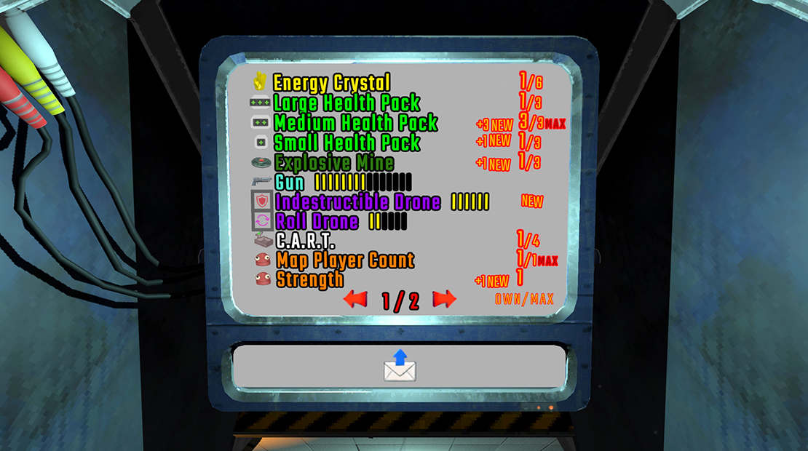

# Owned Items

Ever forgot what you purchased in the previous run?  
How many **Power Crystals** you have left?  
Or how much battery each item has?  
This mod shows you everything you need — clearly and instantly.

#

**Note:**  
If you encounter any issue or bug, please report it here:  
[https://github.com/vesnum/Owned-Items-R.E.P.O-Mod-/issues](https://github.com/vesnum/Owned-Items-R.E.P.O-Mod-/issues)

---

## How It Works

If the mod is **enabled** and running without any issues:

- **Page 0:** The original **Taxman Shop** screen.  
- **Changing Pages:** You can either press the **Left/Right Arrow** keys on your keyboard, or touch the arrows directly on the screen.  

#
- **Item Listing:** You'll now see all the items you own, displayed with icons.  
  Each page shows up to **11 items**, with values shown as `X / Y` next to each.  
- **What does X / Y mean?**  
  - **X** → The current amount of that item you own.  
  - **Y** → The maximum amount you can own.  
  - If the limit is reached, it will display **`MAX`**.  
- **What if I try to buy more than the limit?**  
  Don’t worry — you can’t. Once you reach the maximum amount, the game won’t spawn that item again in the shop until you use one.  
  ⚠️ *However*, the **Power Crystal** behaves differently.  
  You can still buy more even after hitting the limit, and the game will simply consume your extra Crystals **and** the money you spent on them.  
- **New Items:** A newly purchased item will show **`NEW`** or **`+n NEW`** next to its name.  

#
- **Battery Indicators:**  
  You’ll see a row of **I** symbols in front of certain items.  
  - 🟡 **Yellow I** → Remaining battery bars.  
  - ⚫ **Black I** → Used battery bars.

#
---

## Multiplayer Behavior

This mod is **client-based**, but multiplayer-friendly.

- If the **lobby host** has this mod installed, everyone (who has this mod installed) can see all their owned items correctly — just like in singleplayer.  
- If the **host doesn’t have the mod**, other players won’t see newly purchased items until the next shop, and battery levels might appear incorrectly.

---

## Compatibility

This mod does **not modify any original game files**.  
It only **temporarily overrides** the `emojis.material` with `emojisplus.material` inside  
`Canvas/Mask/Text (TMP)` — and **only while in the Shop** —  
to display the new item emojis.

---

## Config Options

- **Enable/Disable the mod manually**   
- **Customize keyboard bindings for navigation**

---

#

